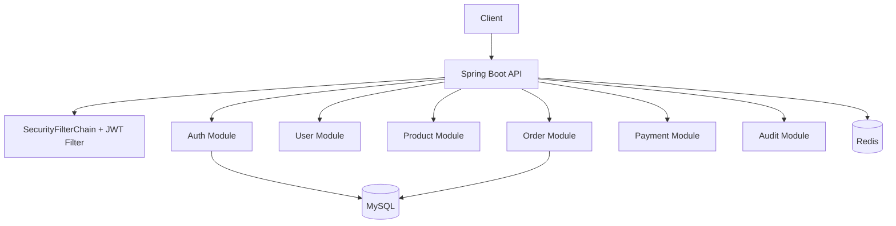

# Java Interview Prep Platform

Production-style Spring Boot 3 backend for a YouTube educational series.

## Tech Stack
Java 17, Spring Boot 3, Security, JPA, MySQL, Redis, JWT, OpenAPI, Maven, Lombok, Testcontainers.

## Modules
- auth
- user
- product
- order
- payment
- audit

## Run
```bash
mvn spring-boot:run
```

## API Docs
- Swagger UI: `http://localhost:8080/swagger-ui/index.html`

## Mermaid Architecture


## Database Entities
users, roles, user_roles, products, orders, order_items, payments, audit_logs, refresh_tokens.

## Future Expansion
- @Transactional demos
- Async processing
- Caching
- Kafka integration
- Concurrency scenarios
