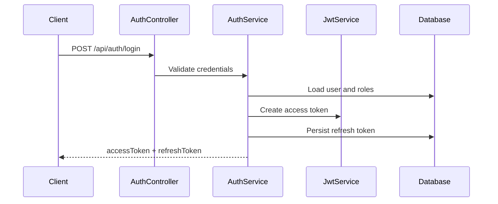
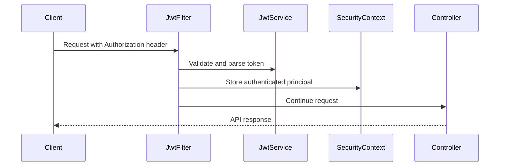
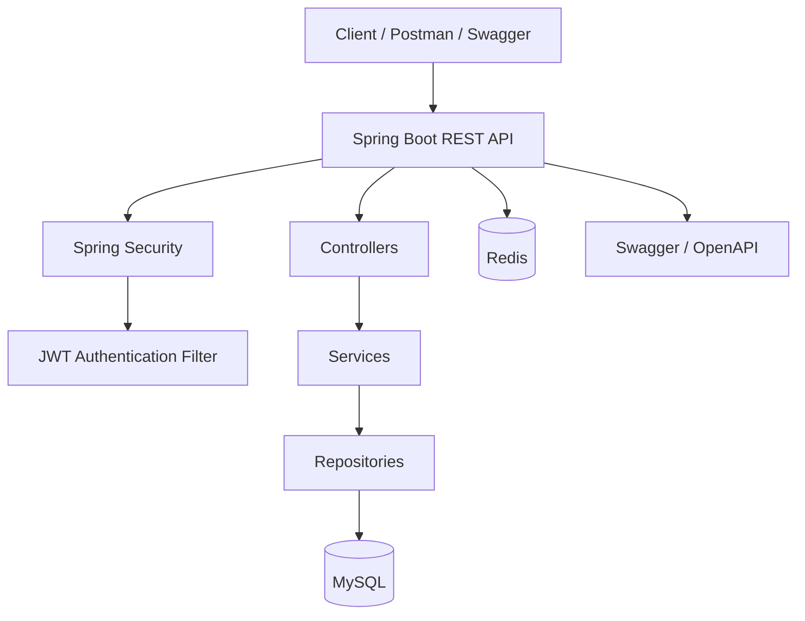

# Java Interview Prep Platform

Production-ready Spring Boot 3 backend for the Java Interview Prep platform. The codebase is structured as a real backend service that can be extended safely while also making Spring Boot, Spring Security, JPA, JWT, validation, and testing concepts easy to study.

## What This Project Covers

- Spring Boot 3 application structure with Java 17 and Maven
- Layered backend architecture using controllers, services, repositories, DTOs, entities, and shared infrastructure
- Stateless JWT authentication with access tokens and refresh tokens
- Spring Security using `SecurityFilterChain`, `JwtAuthenticationFilter`, `SecurityContextHolder`, BCrypt, and method-level authorization
- Role-based access control for `ROLE_USER`, `ROLE_ADMIN`, and `ROLE_MANAGER`
- Bean validation for request DTOs
- Global exception handling for consistent API error responses
- Spring Data JPA persistence with MySQL
- Transaction management with production-style `@Transactional` boundaries and rollback rule examples
- Redis dependency and configuration prepared for caching/session-adjacent use cases
- Swagger/OpenAPI documentation with JWT bearer authentication support
- Seed data for local development
- Postman collection for API testing
- Testcontainers dependencies for integration testing

## Tech Stack

- Java 17
- Spring Boot 3.3.x
- Spring Web
- Spring Security
- Spring Data JPA
- MySQL
- Redis
- JWT using JJWT
- Springdoc OpenAPI
- Maven
- Lombok
- JUnit, Spring Security Test, and Testcontainers

## Project Structure

```text
src/main/java/com/interviewprep/platform
|-- common/exception       # Centralized API exception handling
|-- config                 # Application configuration such as OpenAPI
|-- domain                 # JPA entities
|-- jwt                    # JWT creation, parsing, and validation
|-- repository             # Spring Data JPA repositories
|-- security               # Spring Security configuration and filters
|-- service                # Business workflows
`-- web
    |-- controller         # REST API controllers
    `-- dto                # Request and response DTOs
```

## Functional Modules

- Auth: registration, login, refresh token flow, password hashing, token generation
- User: authenticated user profile and admin user listing
- Product: public product listing and admin/manager product creation
- Order: authenticated order creation and order lookup
- Payment: domain-ready module for future payment workflows
- Audit: domain-ready module for future audit logging and compliance trails
- Transaction Interview Prep: user creation plus audit logging examples for commit, rollback, checked exceptions, and `noRollbackFor`
- AOP Interview Prep: real-world `@Before`, `@After`, and `@Around` advice examples

## API Overview

| Area | Method | Endpoint | Access |
| --- | --- | --- | --- |
| Auth | POST | `/api/auth/register` | Public |
| Auth | POST | `/api/auth/login` | Public |
| Auth | POST | `/api/auth/refresh` | Public |
| User | GET | `/api/users/profile` | Authenticated |
| User | GET | `/api/admin/users` | Admin |
| Product | GET | `/api/products` | Public |
| Product | POST | `/api/admin/products` | Admin, Manager |
| Order | POST | `/api/orders` | Authenticated |
| Order | GET | `/api/orders/{id}` | Authenticated |
| Demo | GET | `/api/demo/n-plus-one/users-orders` | Admin |
| Demo | GET | `/api/demo/users/{userId}/orders-page` | Demo |
| Demo | GET | `/api/demo/payments/slow` | Public |
| Demo | GET | `/api/demo/thread-pool-exhaustion/payments/rest-template` | Authenticated |
| Demo | GET | `/api/demo/thread-pool-exhaustion/payments/completable-future` | Authenticated |
| Demo | GET | `/api/demo/thread-pool-exhaustion/payments/webclient` | Authenticated |
| Demo | GET | `/api/demo/heap-pressure/products` | Authenticated |
| Demo | GET | `/api/demo/heap-pressure/object-churn` | Authenticated |
| AOP Demo | POST | `/api/demo/aop/before/loan-application` | Public |
| AOP Demo | POST | `/api/demo/aop/after/support-ticket-close` | Public |
| AOP Demo | GET | `/api/demo/aop/around/supplier-price-quote` | Public |
| AOP Demo | GET | `/api/demo/aop/around/log-execution-time` | Public |
| Transaction Demo | POST | `/api/demo/transactions/module-1/success` | Authenticated |
| Transaction Demo | POST | `/api/demo/transactions/module-1/audit-failure` | Authenticated |
| Transaction Demo | POST | `/api/demo/transactions/module-2/checked-exception` | Authenticated |
| Transaction Demo | POST | `/api/demo/transactions/module-2/no-rollback-for` | Authenticated |
| Transaction Demo | POST | `/api/demo/transactions/module-3/read-only-query` | Authenticated |
| Transaction Demo | POST | `/api/demo/transactions/module-3/read-only-write-pitfall` | Authenticated |
| Transaction Demo | POST | `/api/demo/transactions/traps/self-invocation` | Authenticated |
| Transaction Demo | POST | `/api/demo/transactions/traps/private-method` | Authenticated |
| Transaction Demo | POST | `/api/demo/transactions/traps/swallowed-exception` | Authenticated |
| Async Internals | POST | `/api/demo/async-internals/place-order-notify` | Authenticated |
| Async Internals | POST | `/api/demo/async-internals/self-invocation` | Authenticated |
| Async Internals | POST | `/api/demo/async-internals/exception-handler` | Authenticated |
| Async Internals | POST | `/api/demo/async-internals/exception-completable-future` | Authenticated |
| Async Internals | POST | `/api/demo/async-internals/threadpool/default-issue` | Authenticated |
| Async Internals | POST | `/api/demo/async-internals/threadpool/custom` | Authenticated |

Use the JWT access token returned by login/register as:

```text
Authorization: Bearer <access-token>
```

Common API response shape:

```json
{
  "status": "SUCCESS",
  "error": false,
  "errorMessage": null,
  "payload": {}
}
```

Global exception responses use the same shape with `error=true` and `payload=null`.

## AOP Interview Prep

These endpoints demonstrate practical Spring AOP advice types with a response trace showing which advice ran.
The same requests are also included in the Postman collection under the Demo section.

### Before Advice - Fraud/Risk Pre-Check

```text
POST /api/demo/aop/before/loan-application
```

Request body:

```json
{
  "customerId": "CUST-101",
  "requestedAmount": 250000,
  "creditScore": 720
}
```

Real-world use case:

Before a bank creates a loan application, a cross-cutting risk policy validates the requested amount and credit score. If the amount is above the auto-approval limit or the score is too low, the advice blocks the call before business logic runs.

### After Advice - Customer Notification

```text
POST /api/demo/aop/after/support-ticket-close?ticketId=TICKET-1001
```

Real-world use case:

After a support ticket workflow finishes, the advice queues a customer notification. This is a good fit for `@After` because the follow-up should happen after the service method completes.

### Around Advice - Timing And Cache

```text
GET /api/demo/aop/around/supplier-price-quote?sku=LAPTOP-PRO&quantity=2
```

Real-world use case:

An e-commerce procurement flow calls a supplier pricing workflow. `@Around` measures the call and caches repeat quote requests, so the second call for the same SKU and quantity returns quickly from the advice without executing the service method again.

### Around Advice - Execution Time Logging

```text
GET /api/demo/aop/around/log-execution-time?region=south&dayCount=30
```

Real-world use case:

An analytics or reporting service often needs timing around a method without changing the method itself. `@Around` is a natural fit because it can start a timer before the call, proceed with the report generation, and log the elapsed time afterward.

## Local Prerequisites

- JDK 17
- Maven 3.9+
- MySQL running on `localhost:3306`
- Redis running on `localhost:6379`

Create the local database before starting the app:

```sql
CREATE DATABASE interview_prep;
```

Default local datasource settings are in `src/main/resources/application.yml`:

```yaml
spring:
  datasource:
    url: jdbc:mysql://localhost:3306/interview_prep
    username: root
    password: root
```

For real environments, override datasource credentials and JWT secrets through environment-specific configuration. Do not use the local defaults outside local development.

## Run Locally

```bash
mvn spring-boot:run
```

The service starts on:

```text
http://localhost:8080
```

Swagger UI is available at:

```text
http://localhost:8080/swagger-ui/index.html
```

OpenAPI JSON is available at:

```text
http://localhost:8080/v3/api-docs
```

## Actuator Monitoring

Spring Boot Actuator is enabled for production-style observability. The health endpoint is public for probes, while the remaining actuator endpoints are protected by Spring Security.

Actuator runs on a separate management port:

```text
http://localhost:8081
```

Tomcat's MBean registry is enabled so servlet container metrics such as `tomcat.threads.current` and `tomcat.threads.busy` are available.

Redis health is disabled in the default local configuration because Redis is currently prepared for future caching features and is not a required runtime dependency for the existing API flows. If Redis becomes business-critical, enable `management.health.redis.enabled=true` and include it in the readiness group.

| Endpoint | Purpose | Production Use |
| --- | --- | --- |
| `http://localhost:8081/actuator/health` | Overall service health | Load balancer or quick operational check |
| `http://localhost:8081/actuator/health/liveness` | Confirms the JVM/application process is alive | Kubernetes liveness probe; restarts app if unhealthy |
| `http://localhost:8081/actuator/health/readiness` | Confirms the app is ready to receive traffic | Kubernetes readiness probe; removes instance from traffic if DB/disk readiness fails |
| `http://localhost:8081/actuator/info` | Application metadata | Confirms deployed service name, version, and description |
| `http://localhost:8081/actuator/metrics` | Available Micrometer metric names | Discover JVM, HTTP, datasource, Tomcat, and process metrics |
| `http://localhost:8081/actuator/metrics/{metric.name}` | Detailed metric values | Inspect specific metrics such as `http.server.requests`, `jvm.memory.used`, or `tomcat.threads.busy` |
| `http://localhost:8081/actuator/prometheus` | Prometheus scrape format | Production metrics scraping by Prometheus/Grafana stacks |
| `http://localhost:8081/actuator/loggers` | Runtime logger levels | Temporarily inspect or adjust logging during incidents |
| `http://localhost:8081/actuator/threaddump` | Live JVM thread dump | Diagnose deadlocks, blocked threads, and thread pool exhaustion |
| `http://localhost:8081/actuator/heapdump` | JVM heap dump | Memory leak investigation; restrict heavily in production |

Important metrics to watch:

- `http.server.requests`: latency, throughput, and API error rates
- `tomcat.threads.busy`: servlet thread pool pressure and exhaustion risk
- `jdbc.connections.active`: database connection pool usage
- `jvm.memory.used`: JVM memory pressure
- `jvm.gc.pause`: garbage collection pause count and duration
- `jvm.threads.live`: thread growth and leak detection
- `process.cpu.usage`: process-level CPU usage
- `system.cpu.usage`: host-level CPU usage

## Build And Test

Compile the project:

```bash
mvn clean compile
```

Run tests:

```bash
mvn test
```

Package the application:

```bash
mvn clean package
```

## Sample Data

The project includes `src/main/resources/data.sql` with:

- An admin user: `admin@prep.com`
- Admin role assignment
- A sample product: `Spring Security Deep Dive`

The seeded admin password hash is intended for local development only. If the password value is changed in the seed file, regenerate it using BCrypt.

## Postman

Import the collection from:

```text
postman/java-interview-prep-platform.postman_collection.json
```

Suggested flow:

1. Register or log in.
2. Copy the returned access token.
3. Set the token as a bearer token for secured requests.
4. Call profile, admin, product, and order APIs.
5. Use refresh token when the access token expires.

## Security Design



Request authorization flow:



## Transaction Interview Prep

The transaction endpoints use realistic service-layer patterns and require a JWT. The authenticated user drives order-oriented examples, and request bodies provide only the business input needed for the use case, such as `productId`.

Important production guidance:

- Put `@Transactional` on service-layer business methods, not on controllers.
- Keep one transaction boundary around one business use case.
- Do not swallow exceptions inside transactional methods unless you deliberately handle rollback state.
- Prefer explicit database constraints and validation for data integrity.
- Use Flyway or Liquibase for schema changes in real environments.
- Treat `noRollbackFor` as a business decision, not a general error-handling shortcut.

### Module 1 - Transaction Fundamentals

Success case:

```text
POST /api/demo/transactions/module-1/success
```

What happens:

- The service creates a user.
- The service creates a `user_audit_logs` row for that user.
- The method returns normally.
- Spring commits both writes together.

Interview explanation:

`@Transactional` starts a transaction before the service method runs. If the method completes without an exception that requires rollback, the transaction manager commits. Both records become visible in the database as one atomic unit.

Failure and rollback case:

```text
POST /api/demo/transactions/module-1/audit-failure
```

What happens:

- The service creates a user first.
- The service then attempts to create an audit row with a missing required `eventType`.
- JPA flushes the invalid audit row and raises a runtime persistence exception.
- Spring rolls back the whole transaction, including the user insert.

Interview explanation:

A transaction is atomic. Even though the user insert happened before the audit failure, it was not independently committed. Because both writes were part of the same transaction, the runtime exception causes the entire unit of work to roll back.

### Module 2 - Rollback Rules

Checked exception default behavior:

```text
POST /api/demo/transactions/module-2/checked-exception
```

What happens:

- The service creates a user.
- The service creates an audit row.
- The service throws a checked `AuditNotificationException`.
- Spring commits by default because checked exceptions do not trigger rollback unless configured.

Interview explanation:

By default, Spring rolls back on `RuntimeException` and `Error`, but not on checked exceptions. If a checked exception should roll back a transaction, configure it explicitly:

```java
@Transactional(rollbackFor = AuditNotificationException.class)
```

Explicit no-rollback behavior:

```text
POST /api/demo/transactions/module-2/no-rollback-for
```

What happens:

- The service creates a user.
- The service creates an audit row.
- The service throws `IllegalStateException`.
- The transaction still commits because the method uses `noRollbackFor`.

Code concept:

```java
@Transactional(noRollbackFor = IllegalStateException.class)
```

Interview explanation:

Runtime exceptions normally roll back. `noRollbackFor` overrides that behavior for a specific exception type. Use it only when the exception represents a non-critical business outcome and committing the data is still correct.

### Module 3 - Read-Only Transactions

Correct read-only use case:

```text
POST /api/demo/transactions/module-3/read-only-query
```

What happens:

- The service method only reads data.
- The method is annotated with `@Transactional(readOnly = true)`.
- The response returns aggregate counts for users and audit logs.

Code concept:

```java
@Transactional(readOnly = true)
public ReadOnlyTransactionResult readOnlySummary() {
    return ReadOnlyTransactionResult.queryOnly(
            userRepository.count(),
            userAuditLogRepository.count(),
            "This service method only reads data...");
}
```

When to use:

- Query-only service methods.
- Reporting or lookup flows where no data should be changed.
- Read paths that need a consistent transactional persistence context.
- Performance-sensitive reads where the JPA provider can skip unnecessary dirty checking work.

Interview explanation:

`readOnly = true` communicates that the transaction is intended only for reads. With Hibernate, Spring can optimize the persistence context for read access. It also documents intent for other developers reviewing the service layer.

Read-only pitfall:

```text
POST /api/demo/transactions/module-3/read-only-write-pitfall
```

What happens:

- The endpoint first creates a baseline user in a normal write transaction.
- A second service method opens `@Transactional(readOnly = true)`.
- That method loads the user, changes `fullName`, and explicitly calls `saveAndFlush`.
- The verification step checks whether the changed name was committed.

Code concept:

```java
@Transactional(readOnly = true)
public ReadOnlyTransactionResult updateUserInsideReadOnlyTransaction(String email) {
    User user = userRepository.findByEmailIgnoreCase(email).orElseThrow();
    user.setFullName("Updated inside read-only transaction");
    userRepository.saveAndFlush(user);
    return ...
}
```

Production warning:

`readOnly = true` is not a security feature and not a replacement for validation, authorization, or code review. Treat it as an optimization and intent marker. Provider and database behavior can vary, especially when code performs explicit writes. If a method must never change data, keep write repositories out of that flow and enforce the rule through architecture, permissions, and tests.

Interview explanation:

A common misconception is that `readOnly = true` always blocks writes. In real applications, it should not be relied on as a hard guard. The production-grade habit is to design read methods so they do not call save methods at all.

### Transactional Traps And Solutions

These endpoints use an order creation flow with three business steps:

- create an `orders` row
- reduce product inventory
- write an audit log

That is a realistic place where transaction mistakes become expensive. A failed audit step should not leave a committed order and reduced stock unless the business explicitly wants that outcome.

#### Trap 1 - Self Invocation Problem

```text
POST /api/demo/transactions/traps/self-invocation
```

Request body:

```json
{
  "productId": 1
}
```

Misconception:

```java
public void outerMethod() {
    createOrderInventoryAndAuditWithTransaction(...);
}

@Transactional
public void createOrderInventoryAndAuditWithTransaction(...) {
    // create order, update inventory, write audit
}
```

What goes wrong:

The outer method calls another method on the same object. Spring's transaction advice is proxy-based, so this internal call does not pass through the Spring proxy. The `@Transactional` annotation on the inner method is bypassed.

Production solution:

- Put the transactional operation on the external service entry method, or
- Move the transactional method to another Spring bean and call that bean, or
- Use a deliberate orchestration service that calls a separate transactional domain service.

Interview phrase:

Self invocation bypasses Spring AOP proxies, so `@Transactional` is not applied.

#### Trap 2 - Private Method

```text
POST /api/demo/transactions/traps/private-method
```

Request body:

```json
{
  "productId": 1
}
```

Misconception:

```java
@Transactional
private void createOrderInventoryAndAudit(...) {
    // create order, update inventory, write audit
}
```

What goes wrong:

Private methods cannot be proxied by Spring's proxy-based AOP transaction mechanism. The annotation is ignored for transaction boundary purposes.

Production solution:

- Put `@Transactional` on a public/protected service method invoked from outside the bean.
- Keep private methods as implementation helpers inside an already transactional public method.

Interview phrase:

`@Transactional` belongs on service methods that Spring can intercept through a proxy.

#### Trap 3 - Swallowed Exceptions And Duplicate Orders

```text
POST /api/demo/transactions/traps/swallowed-exception
```

Request body:

```json
{
  "productId": 1
}
```

Misconception:

```java
@Transactional
public boolean placeOrder(...) {
    createOrder();
    reduceInventory();
    try {
        writeAudit();
    } catch (RuntimeException ex) {
        return false;
    }
}
```

What goes wrong:

Runtime exceptions roll back only when they escape the transactional method. If the method catches the exception and returns normally, Spring commits the transaction. If the client or caller thinks the order failed because audit/payment reporting failed and retries the request, another order or charge can be created.

Production solution:

- Let rollback-worthy exceptions escape the transactional method.
- Convert low-level exceptions into meaningful runtime business exceptions and rethrow them.
- If a method must return an error result instead of throwing, explicitly mark rollback-only:

```java
TransactionAspectSupport.currentTransactionStatus().setRollbackOnly();
```

- For payment/order workflows, also use idempotency keys or unique request IDs so retries cannot create duplicate orders.

Interview phrase:

Spring commits when a transactional method returns normally. Catching an exception can accidentally turn a rollback into a commit.

## N+1 Query Demo

The endpoint below intentionally demonstrates a common performance root cause in Spring Boot applications:

```text
GET /api/demo/n-plus-one/users-orders
```

The active implementation in `NPlusOneDemoService` first loads all users and then queries orders one user at a time:

```java
List<User> users = userRepository.findAll();
return users.stream()
        .map(user -> {
            List<Order> orders = orderRepository.findByUserId(user.getId());
            return UserDtos.UserWithOrdersResponse.from(user, orders);
        })
        .toList();
```

Use the comments in that service to switch between:

- Problem: `userRepository.findAll()` plus `orderRepository.findByUserId(...)`
- Fix A: JPQL `JOIN FETCH`
- Fix B: `@EntityGraph`

SQL logging is enabled in `application.yml` so the extra queries are visible in the console while recording the demo.

User roles are mapped as lazy and fetched explicitly for authentication/profile endpoints. This keeps `user_roles` queries from hiding the intended `users -> orders` N+1 behavior in the demo logs.

For users with hundreds or thousands of orders, avoid loading every order in the same response. Use the paginated endpoint:

```text
GET /api/demo/users/2/orders-page?page=0&size=5
```

`OrderRepository.findPageByUserId(...)` uses `Pageable` with an explicit `countQuery`, so the database returns only the requested page plus a lightweight total count.

## Thread Pool Exhaustion Demo

These endpoints demonstrate how blocking outbound calls can make a Spring Boot API feel slow under load:

```text
GET /api/demo/thread-pool-exhaustion/payments/rest-template?delayMs=2000
GET /api/demo/thread-pool-exhaustion/payments/completable-future?delayMs=2000
GET /api/demo/thread-pool-exhaustion/payments/webclient?delayMs=2000
```

It calls a local slow payment endpoint:

```text
GET /api/demo/payments/slow?delayMs=2000
```

Each endpoint makes one slow payment call. Run 10 concurrent Postman users against each endpoint and compare `tomcat.threads.busy`, response time, and the returned thread names.

- `rest-template`: blocks the incoming Tomcat request thread.
- `completable-future`: releases the incoming request thread and adapts `WebClient`'s `Mono` using `toFuture()`.
- `webclient`: releases the incoming request thread and uses non-blocking outbound HTTP.

For a visible Postman load-test demo, keep `server.tomcat.threads.max=5` and run 10 concurrent users. The RestTemplate endpoint should make the servlet thread pressure easiest to see.

While Postman is running concurrent requests, check:

```text
GET http://localhost:8081/actuator/metrics/tomcat.threads.busy
GET http://localhost:8081/actuator/metrics/tomcat.threads.current
```

## Async Internals Demo

These endpoints show how Spring `@Async` works internally. They use a realistic order flow: place an order on the request thread, then send a notification asynchronously.

All async internals endpoints require a JWT:

```text
Authorization: Bearer <access-token>
```

### Successful Async Notification

```text
POST /api/demo/async-internals/place-order-notify
```

Request body:

```json
{
  "productId": 1
}
```

What to observe:

- The order is created on the servlet request thread.
- Notification runs in `AsyncNotificationService`.
- Console prints a thread like `notification-async-1`.
- The API payload includes both request and notification thread names.

Interview explanation:

`@Async` works when Spring calls the method through a proxy. In this example, `AsyncOrderDemoService` calls a different Spring bean, `AsyncNotificationService`, so the async proxy is applied.

### Async Self Invocation Trap

```text
POST /api/demo/async-internals/self-invocation
```

Request body:

```json
{
  "productId": 1
}
```

What to observe:

- The method is annotated with `@Async`.
- It is called from another method in the same class.
- The observed thread is the same as the request thread.

Interview explanation:

Self invocation bypasses Spring's proxy. The annotation exists, but Spring never intercepts the call, so the method runs synchronously.

Production solution:

- Move async work to another Spring bean.
- Inject and call that bean from the orchestration service.
- Keep async method boundaries public and proxy-invoked.

### Async Exception Handler

```text
POST /api/demo/async-internals/exception-handler
```

Request body:

```json
{
  "productId": 1
}
```

What to observe:

- The endpoint returns successfully after dispatching notification.
- The async notification method throws an exception.
- `AsyncUncaughtExceptionHandler` prints the failure in the console.

Interview explanation:

Exceptions from `void @Async` methods do not return to the caller thread. Use `AsyncUncaughtExceptionHandler` for centralized handling. For async methods returning `CompletableFuture`, handle failures through the future pipeline.

### Async Exception Handling With CompletableFuture

```text
POST /api/demo/async-internals/exception-completable-future
```

Request body:

```json
{
  "productId": 1
}
```

What to observe:

- The async notification method returns `CompletableFuture<String>`.
- The notification still fails on the async thread.
- The caller observes the failure through `join()` as a `CompletionException`.
- The API response explains that `exceptionally(...)`, `handle(...)`, `get()`, or `join()` can be used to handle the failure.

Interview explanation:

For `void @Async`, failures go to `AsyncUncaughtExceptionHandler`. For `CompletableFuture` async methods, the exception is captured by the returned future. This is usually better when the caller needs to react to success or failure.

### Default Threadpool Issue

```text
POST /api/demo/async-internals/threadpool/default-issue
```

Request body:

```json
{
  "tasks": 10
}
```

What to observe:

- The demo uses `SimpleAsyncTaskExecutor`.
- Console prints thread names like `simple-async-demo-1`, `simple-async-demo-2`, and so on.
- This executor creates new threads rather than reusing a bounded pool.

Interview explanation:

Relying on an unbounded/simple async executor can create too many threads under load. That increases memory usage, context switching, and failure risk.

### Custom Threadpool Config

```text
POST /api/demo/async-internals/threadpool/custom
```

Request body:

```json
{
  "tasks": 10
}
```

What to observe:

- The demo uses a bounded `ThreadPoolTaskExecutor`.
- Console prints thread names like `notification-async-1`.
- Threads are reused by the configured pool.

Production guidance:

- Define dedicated executors for important async workloads.
- Set core size, max size, queue capacity, and thread name prefix.
- Monitor queue depth, active threads, and rejected tasks.
- Do not put critical data consistency work only in fire-and-forget async methods.

## JVM Heap Pressure And GC Pause Demo

Use these endpoints to demonstrate heap pressure and GC pauses:

```text
GET /api/demo/heap-pressure/products?page=0&size=100
GET /api/demo/heap-pressure/object-churn?lines=50000
```

How to check heap and GC through actuator:

```text
GET http://localhost:8081/actuator/metrics/jvm.memory.used
GET http://localhost:8081/actuator/metrics/jvm.memory.committed
GET http://localhost:8081/actuator/metrics/jvm.memory.max
GET http://localhost:8081/actuator/metrics/jvm.gc.pause
GET http://localhost:8081/actuator/metrics/jvm.gc.memory.allocated
GET http://localhost:8081/actuator/metrics/jvm.gc.memory.promoted
```

What to explain:

- `jvm.memory.used`: how much heap/non-heap memory is currently used. Filter by tags such as `area=heap` when inspecting in a metrics backend.
- `jvm.gc.pause`: GC pause count and total/max pause time. If this rises during a request, the JVM is spending time reclaiming memory.
- `jvm.gc.memory.allocated`: allocation rate. Object-heavy loops push this up quickly.
- `jvm.gc.memory.promoted`: objects surviving young GC and moving toward old generation.

Problem pattern 1 is implemented in `HeapPressureDemoService.exportProductsWithFindAll(...)`: it uses `productRepository.findAll()` and maps every product to an export DTO in memory. The commented fix uses `productRepository.findAll(PageRequest.of(page, size))` so the export loads one page of products at a time.

Problem pattern 2 is implemented in `HeapPressureDemoService.createObjectsInTightLoop(...)`: it builds product report lines inside a tight loop and retains all lines until the response is built. The commented fix pre-sizes the list and uses an explicitly sized `StringBuilder`; `String.format(...)` is more readable for normal code paths, but usually heavier in hot loops.

## Architecture



## Persistence Model

Core tables represented or planned in the domain model:

- `users`
- `roles`
- `user_roles`
- `products`
- `orders`
- `order_items`
- `payments`
- `audit_logs`
- `refresh_tokens`

## Production Notes

- Keep JWT secrets outside source control and rotate them through environment-specific secret management.
- Use schema migration tooling such as Flyway or Liquibase before production deployment.
- Prefer explicit DTOs and service-layer boundaries for all new write operations.
- Add structured logging and trace/correlation IDs before exposing the service publicly.
- Keep `spring.jpa.open-in-view=false` to avoid hidden lazy-loading behavior in controllers.
- Replace local seed credentials before using shared environments.
- Add pagination and filtering before exposing large collection endpoints.

## Expansion Roadmap

The project is intentionally structured so future features can be added without changing the core architecture:

- Transaction boundary examples using `@Transactional`
- Async processing with `@Async` and executor configuration
- Redis caching with cache invalidation examples
- Kafka-based event publishing for order/payment/audit workflows
- Optimistic and pessimistic locking examples
- Payment provider integration
- Audit log persistence and event history
- Docker Compose for local infrastructure
- Flyway or Liquibase migration management
