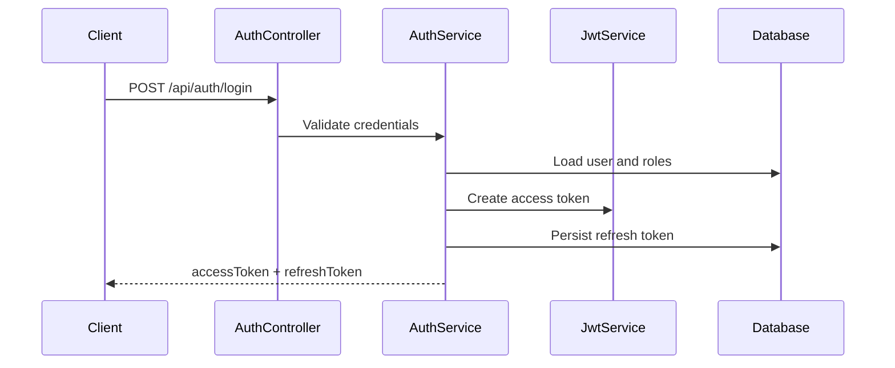
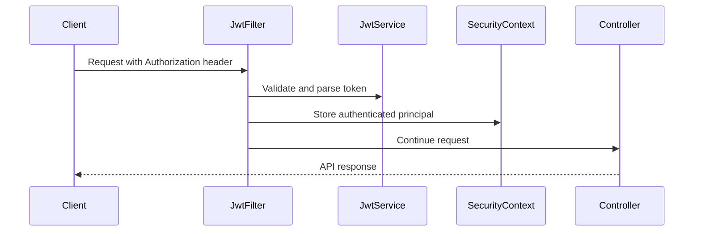
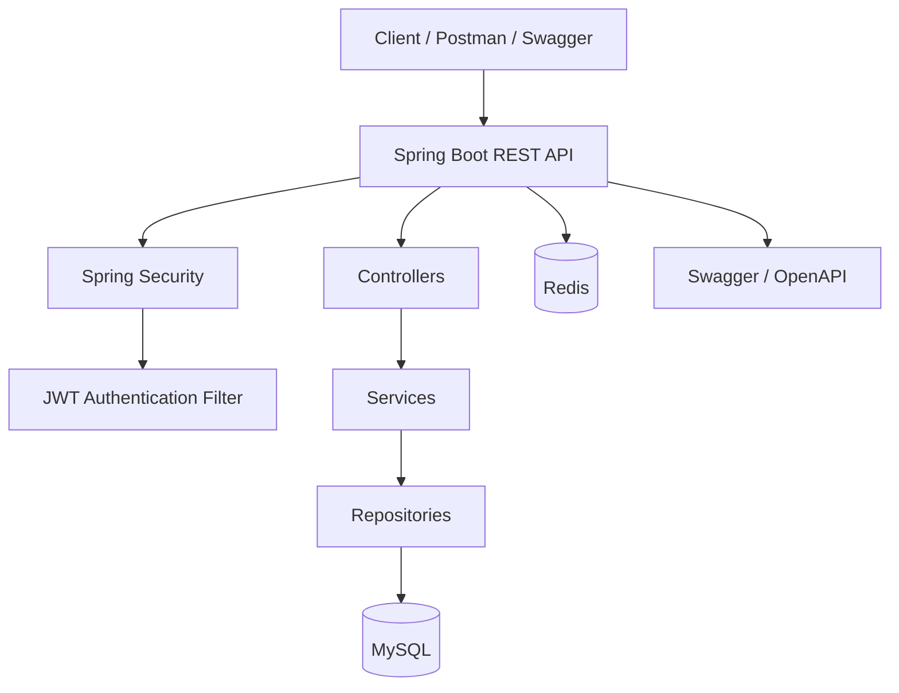

# Java Interview Prep Platform

Production-ready Spring Boot 3 backend for the Java Interview Prep platform. The codebase is structured as a real backend service that can be extended safely while also making Spring Boot, Spring Security, JPA, JWT, validation, and testing concepts easy to study.

## What This Project Covers

- Spring Boot 3 application structure with Java 17 and Maven
- Layered backend architecture using controllers, services, repositories, DTOs, entities, and shared infrastructure
- Stateless JWT authentication with access tokens and refresh tokens
- Spring Security using `SecurityFilterChain`, `JwtAuthenticationFilter`, `SecurityContextHolder`, BCrypt, and method-level authorization
- Role-based access control for `ROLE_USER`, `ROLE_ADMIN`, and `ROLE_MANAGER`
- Bean validation for request DTOs
- Global exception handling for consistent API error responses
- Spring Data JPA persistence with MySQL
- Redis dependency and configuration prepared for caching/session-adjacent use cases
- Swagger/OpenAPI documentation with JWT bearer authentication support
- Seed data for local development
- Postman collection for API testing
- Testcontainers dependencies for integration testing

## Tech Stack

- Java 17
- Spring Boot 3.3.x
- Spring Web
- Spring Security
- Spring Data JPA
- MySQL
- Redis
- JWT using JJWT
- Springdoc OpenAPI
- Maven
- Lombok
- JUnit, Spring Security Test, and Testcontainers

## Project Structure

```text
src/main/java/com/interviewprep/platform
|-- common/exception       # Centralized API exception handling
|-- config                 # Application configuration such as OpenAPI
|-- domain                 # JPA entities
|-- jwt                    # JWT creation, parsing, and validation
|-- repository             # Spring Data JPA repositories
|-- security               # Spring Security configuration and filters
|-- service                # Business workflows
`-- web
    |-- controller         # REST API controllers
    `-- dto                # Request and response DTOs
```

## Functional Modules

- Auth: registration, login, refresh token flow, password hashing, token generation
- User: authenticated user profile and admin user listing
- Product: public product listing and admin/manager product creation
- Order: authenticated order creation and order lookup
- Payment: domain-ready module for future payment workflows
- Audit: domain-ready module for future audit logging and compliance trails

## API Overview

| Area | Method | Endpoint | Access |
| --- | --- | --- | --- |
| Auth | POST | `/api/auth/register` | Public |
| Auth | POST | `/api/auth/login` | Public |
| Auth | POST | `/api/auth/refresh` | Public |
| User | GET | `/api/users/profile` | Authenticated |
| User | GET | `/api/admin/users` | Admin |
| Product | GET | `/api/products` | Public |
| Product | POST | `/api/admin/products` | Admin, Manager |
| Order | POST | `/api/orders` | Authenticated |
| Order | GET | `/api/orders/{id}` | Authenticated |
| Demo | GET | `/api/demo/n-plus-one/users-orders` | Admin |
| Demo | GET | `/api/demo/users/{userId}/orders-page` | Demo |
| Demo | GET | `/api/demo/payments/slow` | Public |
| Demo | GET | `/api/demo/thread-pool-exhaustion/payments/rest-template` | Authenticated |
| Demo | GET | `/api/demo/thread-pool-exhaustion/payments/completable-future` | Authenticated |
| Demo | GET | `/api/demo/thread-pool-exhaustion/payments/webclient` | Authenticated |
| Demo | GET | `/api/demo/heap-pressure/products` | Authenticated |
| Demo | GET | `/api/demo/heap-pressure/object-churn` | Authenticated |

Use the JWT access token returned by login/register as:

```text
Authorization: Bearer <access-token>
```

## Local Prerequisites

- JDK 17
- Maven 3.9+
- MySQL running on `localhost:3306`
- Redis running on `localhost:6379`

Create the local database before starting the app:

```sql
CREATE DATABASE interview_prep;
```

Default local datasource settings are in `src/main/resources/application.yml`:

```yaml
spring:
  datasource:
    url: jdbc:mysql://localhost:3306/interview_prep
    username: root
    password: root
```

For real environments, override datasource credentials and JWT secrets through environment-specific configuration. Do not use the local defaults outside local development.

## Run Locally

```bash
mvn spring-boot:run
```

The service starts on:

```text
http://localhost:8080
```

Swagger UI is available at:

```text
http://localhost:8080/swagger-ui/index.html
```

OpenAPI JSON is available at:

```text
http://localhost:8080/v3/api-docs
```

## Actuator Monitoring

Spring Boot Actuator is enabled for production-style observability. The health endpoint is public for probes, while the remaining actuator endpoints are protected by Spring Security.

Actuator runs on a separate management port:

```text
http://localhost:8081
```

Tomcat's MBean registry is enabled so servlet container metrics such as `tomcat.threads.current` and `tomcat.threads.busy` are available.

Redis health is disabled in the default local configuration because Redis is currently prepared for future caching features and is not a required runtime dependency for the existing API flows. If Redis becomes business-critical, enable `management.health.redis.enabled=true` and include it in the readiness group.

| Endpoint | Purpose | Production Use |
| --- | --- | --- |
| `http://localhost:8081/actuator/health` | Overall service health | Load balancer or quick operational check |
| `http://localhost:8081/actuator/health/liveness` | Confirms the JVM/application process is alive | Kubernetes liveness probe; restarts app if unhealthy |
| `http://localhost:8081/actuator/health/readiness` | Confirms the app is ready to receive traffic | Kubernetes readiness probe; removes instance from traffic if DB/disk readiness fails |
| `http://localhost:8081/actuator/info` | Application metadata | Confirms deployed service name, version, and description |
| `http://localhost:8081/actuator/metrics` | Available Micrometer metric names | Discover JVM, HTTP, datasource, Tomcat, and process metrics |
| `http://localhost:8081/actuator/metrics/{metric.name}` | Detailed metric values | Inspect specific metrics such as `http.server.requests`, `jvm.memory.used`, or `tomcat.threads.busy` |
| `http://localhost:8081/actuator/prometheus` | Prometheus scrape format | Production metrics scraping by Prometheus/Grafana stacks |
| `http://localhost:8081/actuator/loggers` | Runtime logger levels | Temporarily inspect or adjust logging during incidents |
| `http://localhost:8081/actuator/threaddump` | Live JVM thread dump | Diagnose deadlocks, blocked threads, and thread pool exhaustion |
| `http://localhost:8081/actuator/heapdump` | JVM heap dump | Memory leak investigation; restrict heavily in production |

Important metrics to watch:

- `http.server.requests`: latency, throughput, and API error rates
- `tomcat.threads.busy`: servlet thread pool pressure and exhaustion risk
- `jdbc.connections.active`: database connection pool usage
- `jvm.memory.used`: JVM memory pressure
- `jvm.gc.pause`: garbage collection pause count and duration
- `jvm.threads.live`: thread growth and leak detection
- `process.cpu.usage`: process-level CPU usage
- `system.cpu.usage`: host-level CPU usage

## Build And Test

Compile the project:

```bash
mvn clean compile
```

Run tests:

```bash
mvn test
```

Package the application:

```bash
mvn clean package
```

## Sample Data

The project includes `src/main/resources/data.sql` with:

- An admin user: `admin@prep.com`
- Admin role assignment
- A sample product: `Spring Security Deep Dive`

The seeded admin password hash is intended for local development only. If the password value is changed in the seed file, regenerate it using BCrypt.

## Postman

Import the collection from:

```text
postman/java-interview-prep-platform.postman_collection.json
```

Suggested flow:

1. Register or log in.
2. Copy the returned access token.
3. Set the token as a bearer token for secured requests.
4. Call profile, admin, product, and order APIs.
5. Use refresh token when the access token expires.

## Security Design



Request authorization flow:



## N+1 Query Demo

The endpoint below intentionally demonstrates a common performance root cause in Spring Boot applications:

```text
GET /api/demo/n-plus-one/users-orders
```

The active implementation in `NPlusOneDemoService` first loads all users and then queries orders one user at a time:

```java
List<User> users = userRepository.findAll();
return users.stream()
        .map(user -> {
            List<Order> orders = orderRepository.findByUserId(user.getId());
            return UserDtos.UserWithOrdersResponse.from(user, orders);
        })
        .toList();
```

Use the comments in that service to switch between:

- Problem: `userRepository.findAll()` plus `orderRepository.findByUserId(...)`
- Fix A: JPQL `JOIN FETCH`
- Fix B: `@EntityGraph`

SQL logging is enabled in `application.yml` so the extra queries are visible in the console while recording the demo.

User roles are mapped as lazy and fetched explicitly for authentication/profile endpoints. This keeps `user_roles` queries from hiding the intended `users -> orders` N+1 behavior in the demo logs.

For users with hundreds or thousands of orders, avoid loading every order in the same response. Use the paginated endpoint:

```text
GET /api/demo/users/2/orders-page?page=0&size=5
```

`OrderRepository.findPageByUserId(...)` uses `Pageable` with an explicit `countQuery`, so the database returns only the requested page plus a lightweight total count.

## Thread Pool Exhaustion Demo

These endpoints demonstrate how blocking outbound calls can make a Spring Boot API feel slow under load:

```text
GET /api/demo/thread-pool-exhaustion/payments/rest-template?delayMs=2000
GET /api/demo/thread-pool-exhaustion/payments/completable-future?delayMs=2000
GET /api/demo/thread-pool-exhaustion/payments/webclient?delayMs=2000
```

It calls a local slow payment endpoint:

```text
GET /api/demo/payments/slow?delayMs=2000
```

Each endpoint makes one slow payment call. Run 10 concurrent Postman users against each endpoint and compare `tomcat.threads.busy`, response time, and the returned thread names.

- `rest-template`: blocks the incoming Tomcat request thread.
- `completable-future`: releases the incoming request thread and adapts `WebClient`'s `Mono` using `toFuture()`.
- `webclient`: releases the incoming request thread and uses non-blocking outbound HTTP.

For a visible Postman load-test demo, keep `server.tomcat.threads.max=5` and run 10 concurrent users. The RestTemplate endpoint should make the servlet thread pressure easiest to see.

While Postman is running concurrent requests, check:

```text
GET http://localhost:8081/actuator/metrics/tomcat.threads.busy
GET http://localhost:8081/actuator/metrics/tomcat.threads.current
```

## JVM Heap Pressure And GC Pause Demo

Use these endpoints to demonstrate heap pressure and GC pauses:

```text
GET /api/demo/heap-pressure/products?page=0&size=100
GET /api/demo/heap-pressure/object-churn?lines=50000
```

How to check heap and GC through actuator:

```text
GET http://localhost:8081/actuator/metrics/jvm.memory.used
GET http://localhost:8081/actuator/metrics/jvm.memory.committed
GET http://localhost:8081/actuator/metrics/jvm.memory.max
GET http://localhost:8081/actuator/metrics/jvm.gc.pause
GET http://localhost:8081/actuator/metrics/jvm.gc.memory.allocated
GET http://localhost:8081/actuator/metrics/jvm.gc.memory.promoted
```

What to explain:

- `jvm.memory.used`: how much heap/non-heap memory is currently used. Filter by tags such as `area=heap` when inspecting in a metrics backend.
- `jvm.gc.pause`: GC pause count and total/max pause time. If this rises during a request, the JVM is spending time reclaiming memory.
- `jvm.gc.memory.allocated`: allocation rate. Object-heavy loops push this up quickly.
- `jvm.gc.memory.promoted`: objects surviving young GC and moving toward old generation.

Problem pattern 1 is implemented in `HeapPressureDemoService.exportProductsWithFindAll(...)`: it uses `productRepository.findAll()` and maps every product to an export DTO in memory. The commented fix uses `productRepository.findAll(PageRequest.of(page, size))` so the export loads one page of products at a time.

Problem pattern 2 is implemented in `HeapPressureDemoService.createObjectsInTightLoop(...)`: it builds product report lines inside a tight loop and retains all lines until the response is built. The commented fix pre-sizes the list and uses an explicitly sized `StringBuilder`; `String.format(...)` is more readable for normal code paths, but usually heavier in hot loops.

## Architecture



## Persistence Model

Core tables represented or planned in the domain model:

- `users`
- `roles`
- `user_roles`
- `products`
- `orders`
- `order_items`
- `payments`
- `audit_logs`
- `refresh_tokens`

## Production Notes

- Keep JWT secrets outside source control and rotate them through environment-specific secret management.
- Use schema migration tooling such as Flyway or Liquibase before production deployment.
- Prefer explicit DTOs and service-layer boundaries for all new write operations.
- Add structured logging and trace/correlation IDs before exposing the service publicly.
- Keep `spring.jpa.open-in-view=false` to avoid hidden lazy-loading behavior in controllers.
- Replace local seed credentials before using shared environments.
- Add pagination and filtering before exposing large collection endpoints.

## Expansion Roadmap

The project is intentionally structured so future features can be added without changing the core architecture:

- Transaction boundary examples using `@Transactional`
- Async processing with `@Async` and executor configuration
- Redis caching with cache invalidation examples
- Kafka-based event publishing for order/payment/audit workflows
- Optimistic and pessimistic locking examples
- Payment provider integration
- Audit log persistence and event history
- Docker Compose for local infrastructure
- Flyway or Liquibase migration management
